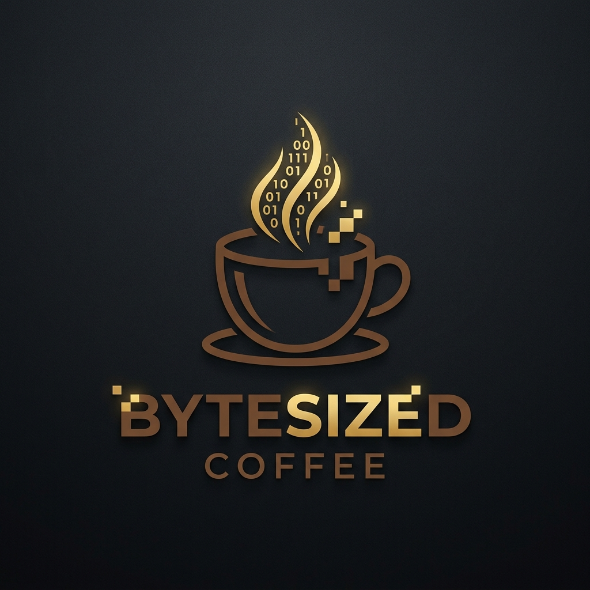
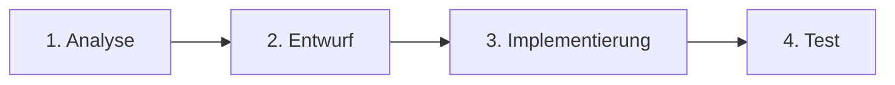
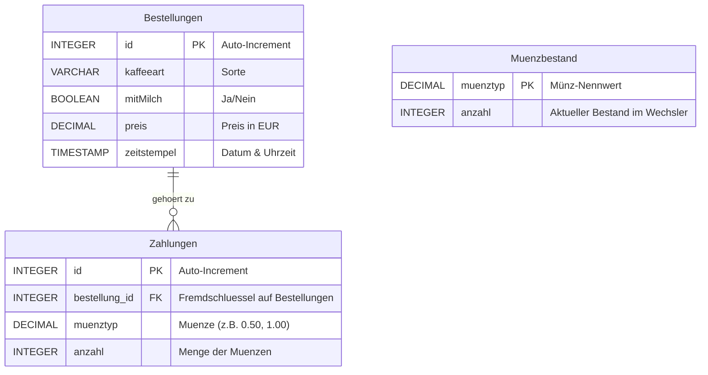
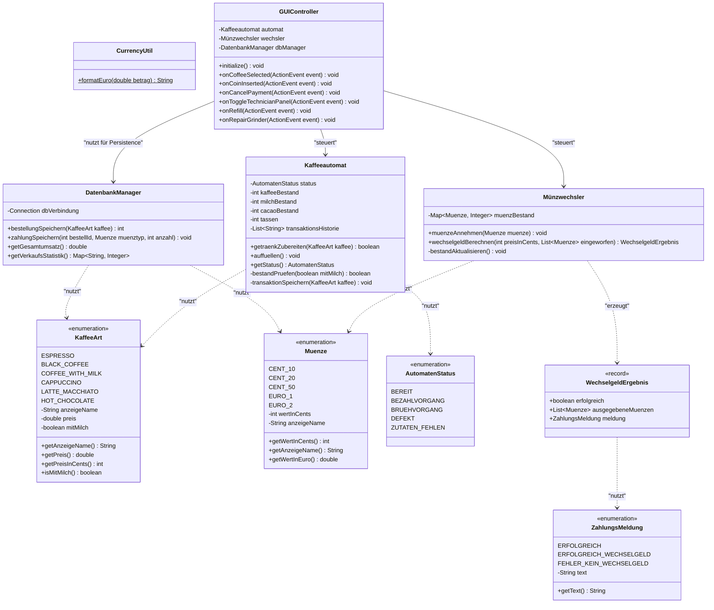

# ByteSized Coffee - Smart Coffee & Payment System



> [!WARNING]
> **Haftungsausschluss**
> Dies ist ein Software-Prototyp. Jegliche Interaktion mit realen Münzen oder elektronischen Zahlungsgeräten ist im Rahmen dieses Projekts nicht vorgesehen und wird nicht unterstützt.

> [!NOTE]
> **Schulprojekt / Lern-Projekt**
> Dieses Projekt wurde im Rahmen einer schulischen Projektwoche entwickelt. Es dient als praktische Übung zur Anwendung von JavaFX, Software-Design-Mustern (MVC-Pattern), automatisierter Qualitätssicherung mit JUnit-Tests und Datenbank-Persistenz mit SQLite.

Dieses Projekt umfasst die Entwicklung eines softwarebasierten Steuerungssystems für einen Kaffeeautomaten mit integriertem Bezahl- und Münzwechselsystem für die Marke **ByteSized Coffee**. Das System trennt Benutzeroberfläche (JavaFX), Geschäftslogik und Datenhaltung (SQLite).

---

## Projektphasen (nach Vorgehensmodell)

Das Projekt folgt dem klassischen Ablauf aus der Softwaretechnik, wie im Phasenmodell der Projektwoche vorgegeben:



---

## 1. Analyse & Entwurf (Design Phase)

### 1.1 Funktionale Anforderungen (Analyse)
* **Kaffeezubereitung**: Auswahl aus 6 Kaffeesorten mit/ohne Milch:
  * **Espresso** (ohne Milch, 25g Bohnen, 1.50 EUR)
  * **Black Coffee** (ohne Milch, 25g Bohnen, 1.80 EUR)
  * **Coffee with Milk** (mit Milch, 25g Bohnen, 10g Milchpulver, 2.00 EUR)
  * **Cappuccino** (mit Milch, 25g Bohnen, 10g Milchpulver, 2.50 EUR)
  * **Latte Macchiato** (mit Milch, 25g Bohnen, 10g Milchpulver, 2.80 EUR)
  * **Hot Chocolate** (mit Milch, 15g Kakaopulver, 10g Milchpulver, 2.20 EUR)
* **Bestandsprüfung**: Überprüfung der Bestände (Start: 2000g Kaffee, 200g Milch, 100g Kakao). Automatische Reduzierung bei erfolgreicher Zubereitung.
* **Bezahlsystem**: Münzeingabe (10c, 20c, 50c, 1€, 2€), Wechselgeldberechnung. Speicherung der eingeworfenen Münzen zur detaillierten Transaktionsanalyse. Die eingeworfenen Münzen werden vor der Wechselgeldberechnung dem internen Bestand hinzugefügt.
* **Systemverwaltung**: Erfassung aller Bestellungen und Münzbestände in einer lokalen SQLite-Datenbank. Fehlerbehandlung bei Ressourcenmangel oder simuliertem Defekt (2% Ausfallwahrscheinlichkeit).

---

### 1.2 Datenbankdesign (ER-Modell)
Die Datenhaltung erfolgt in einer SQLite-Datenbank (`coffee_system.db`). Die Tabellenstruktur wird über das folgende Entity-Relationship-Diagramm (ERD) definiert:



---

### 1.3 Systemarchitektur (Klassendiagramm)
Die Klassenstruktur basiert auf dem **Model-View-Controller (MVC) Pattern**, um GUI, Logik und Datenbank sauber zu trennen (Separation of Concerns). Die Domänentypen, Systemzustände und Rückgabewerte werden durch Enums und Records gekapselt:



---

### 1.4 Ergänzende Code-Strukturierung (Clean Code & Separation)
Um die Lesbarkeit des Quellcodes zu maximieren und die Wartbarkeit zu verbessern, implementieren wir folgende Mechanismen:
1. **Externe SQL-Initialisierungsdatei (`schema.sql`)**: Die Datenbanktabellen-Erstellungsskripte liegen getrennt in `src/main/resources/com/smartcoffee/database/schema.sql`. Der `DatenbankManager` liest diese SQL-Datei beim Start ein.
2. **Java Record (`WechselgeldErgebnis`)**: Zur Kapselung des Rückgabewertes der Wechselgeld-Berechnung nutzen wir ein kompaktes Java Record, um redundanten Boilerplate-Code zu vermeiden.
3. **Formatierungsklasse (`CurrencyUtil`)**: Eine Hilfsklasse stellt die einheitliche Formatierung von Euro-Preisen über das gesamte System sicher (z.B. `1,50 €`), um Codeduplizierung im UI und Logger zu vermeiden.

---

### 1.5 Implementierte JavaFX Benutzeroberfläche
Die grafische Benutzeroberfläche (`main_layout.fxml` & `styles.css`) wurde als moderner, dunkler Simulator mit Premium-Asthetik umgesetzt. Sie ist in zwei funktionale Bereiche unterteilt:

1. **Kunden-Touchscreen (Linke Seite)**:
   * **Menüauswahl**: 6 stilvolle Getränkekarten mit professionellen, AI-generierten Produktfotos (Espresso, Schwarzer Kaffee, Cappuccino, Latte Macchiato, Heiße Schokolade, Milchkaffee).
   * **Bühnen-Hintergrund**: Ein großes, dezentes Branding-Wasserzeichen des ByteSized Coffee Logos im Hintergrund (`fitWidth="460"`, `opacity="0.09"`, `mouseTransparent="true"`).
   * **Münzeinwurf**: Physisch angeordneter Münzeinwurfbalken mit stilisierter, kreisrunder Münz-Tastatur (`10c`, `20c`, `50c`, `1€`, `2€`) direkt neben einem grün leuchtenden, digital-segmentierten LED-Kreditdisplay.
   * **Zubereitungs-Animation**: Während des Brühvorgangs blockiert ein transluzentes Overlay die Interaktion. Ein stilisierter Becher füllt sich in Echtzeit mit Kaffeeflüssigkeit, synchronisiert mit dem Fortschrittsbalken (Mahlen $\rightarrow$ Erhitzen & Brühen $\rightarrow$ Ausgeben $\rightarrow$ Fertig).

2. **Entwickler- & Bedienerkonsole (Rechte Seite - Ein-/Ausklappbar)**:
   * **Techniker-Drawer**: Über die Menütaste (`☰ Admin`) im Kunden-Touchscreen kann die Konsole dynamisch ein- und ausgeblendet werden. Die Fensterbreite passt sich fließend an (`720px` eingeklappt, `1080px` ausgeklappt).
   * **Zutaten-Tanks**: 3 vertikale, pillenförmige Glasröhren zur Füllstandsanzeige (Kaffeebohnen, Milchpulver, Kakaopulver). Fällt ein Bestand unter das kritische Minimum, glühen die Röhren-Ränder rot auf.
   * **Kassenstand & Münzbestand**: Ein geteiltes Side-by-Side-Panel. Links stehen Umsatz, Kasseninhalt und die Tassenzahl; rechts steht der detaillierte, vertikal ausgerichtete Münzwechslerbestand pro Münztyp (in absteigender Reihenfolge).
   * **Terminal-Konsole**: Ein retro-grün leuchtendes Log-Fenster, das live Datenbankereignisse, PRAGMA-Initialisierungen und Fehlercodes ausgibt.
   * **Bedieneraktionen**: Tasten zum manuellen Auffüllen des Automaten und zur Reparatur des Mahlwerks bei Ausfällen.

---

## 2. Verwendung & Ausführung

### Voraussetzungen
* **Java SDK 21**
* **Maven 3.x**

### Anwendung starten
Im Projektverzeichnis folgenden Befehl ausführen:
```bash
mvn javafx:run
```

### Entwickler-Dokumentation (JavaDoc)
Die JavaDoc-Dokumentation für alle Klassen und Schnittstellen kann mit folgendem Befehl generiert werden:
```bash
mvn javadoc:javadoc
```
Nach erfolgreicher Generierung befindet sich die Dokumentation im Ordner `target/site/apidocs/` und kann durch Öffnen der Datei `index.html` im Webbrowser eingesehen werden.
