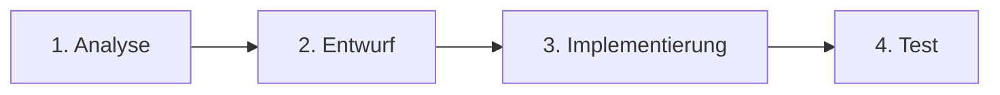
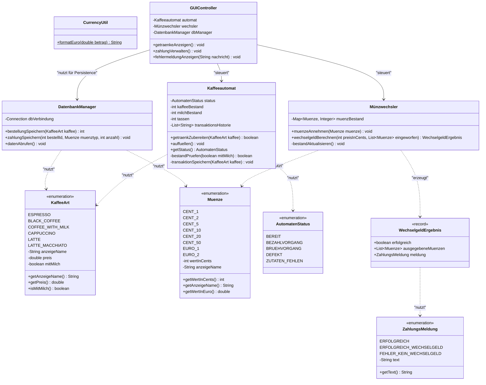

# ByteSized Coffee - Smart Coffee & Payment System


Dieses Projekt umfasst die Entwicklung eines softwarebasierten Steuerungssystems für einen Kaffeeautomaten mit integriertem Bezahl- und Münzwechselsystem für die Marke **ByteSized Coffee**. Das System trennt Benutzeroberfläche (JavaFX), Geschäftslogik und Datenhaltung (SQLite).

---

## Projektphasen (nach Vorgehensmodell)

Das Projekt folgt dem klassischen Ablauf aus der Softwaretechnik, wie im Phasenmodell der Projektwoche vorgegeben:



---

## 1. Analyse & Entwurf (Design Phase)

### 1.1 Funktionale Anforderungen (Analyse)
* **Kaffeezubereitung**: Auswahl aus 6 Kaffeesorten mit/ohne Milch:
  * **Espresso** (ohne Milch, 25g Bohnen, 1.50 EUR)
  * **Black Coffee** (ohne Milch, 25g Bohnen, 2.00 EUR)
  * **Coffee with Milk** (mit Milch, 25g Bohnen, 10g Milchpulver, 2.20 EUR)
  * **Cappuccino** (mit Milch, 25g Bohnen, 10g Milchpulver, 2.50 EUR)
  * **Latte** (mit Milch, 25g Bohnen, 10g Milchpulver, 2.50 EUR)
  * **Latte Macchiato** (mit Milch, 25g Bohnen, 10g Milchpulver, 2.80 EUR)
* **Bestandsprüfung**: Überprüfung der Bestände (Start: 2000g Kaffee, 200g Milch). Automatische Reduzierung bei erfolgreicher Zubereitung.
* **Bezahlsystem**: Münzeingabe (von 1 Ct bis 2 €), Wechselgeldberechnung. Speicherung der eingeworfenen Münzen zur detaillierten Transaktionsanalyse. Die eingeworfenen Münzen werden vor der Wechselgeldberechnung dem internen Bestand hinzugefügt.
* **Systemverwaltung**: Erfassung aller Bestellungen und Münzbestände in einer lokalen SQLite-Datenbank. Fehlerbehandlung bei Ressourcenmangel oder simuliertem Defekt (2% Ausfallwahrscheinlichkeit).

---

### 1.2 Datenbankdesign (ER-Modell)
Die Datenhaltung erfolgt in einer SQLite-Datenbank (`coffee_system.db`). Die Tabellenstruktur wird über das folgende Entity-Relationship-Diagramm (ERD) definiert:


---

### 1.3 Systemarchitektur (Klassendiagramm)
Die Klassenstruktur basiert auf dem **Model-View-Controller (MVC) Pattern**, um GUI, Logik und Datenbank sauber zu trennen (Separation of Concerns). Die Domänentypen, Systemzustände und Rückgabewerte werden durch Enums und Records gekapselt:



---

### 1.4 Ergänzende Code-Strukturierung (Clean Code & Separation)
Um die Lesbarkeit des Quellcodes zu maximieren und die Wartbarkeit zu verbessern, implementieren wir folgende Mechanismen:
1. **Externe SQL-Initialisierungsdatei (`schema.sql`)**: Die Datenbanktabellen-Erstellungsskripte liegen getrennt in `src/main/resources/com/smartcoffee/database/schema.sql`. Der `DatenbankManager` liest diese SQL-Datei beim Start ein.
2. **Java Record (`WechselgeldErgebnis`)**: Zur Kapselung des Rückgabewertes der Wechselgeld-Berechnung nutzen wir ein kompaktes Java Record, um redundanten Boilerplate-Code zu vermeiden.
3. **Formatierungsklasse (`CurrencyUtil`)**: Eine Hilfsklasse stellt die einheitliche Formatierung von Euro-Preisen über das gesamte System sicher (z.B. `1,50 €`), um Codeduplizierung im UI und Logger zu vermeiden.

---

### 1.5 GUI-Entwurf (Skizze)
Die JavaFX-Oberfläche besteht aus einem Hauptfenster und einem Zahlungsdialog mit einem modernen, dunklen Design und dem **ByteSized Coffee** Logo im Hintergrund:
1. **Hauptfenster**:
   * Getränkeauswahl (Buttons für Espresso, Black Coffee, Coffee with Milk, Cappuccino, Latte, Latte Macchiato) inklusive Preisangabe auf jedem Button.
   * Statusanzeige der Bestände als visuelle Balken mit exakter Grammangabe (z.B. `1450g / 2000g`).
   * Anzeige der insgesamt ausgegebenen Tassen.
   * Fehler-/Info-Log für Statusmeldungen (z.B. "Mahlwerk defekt!", "Bitte Bohnen auffüllen").
2. **Zahlungsfenster**:
   * Münzeinwurftasten als stilisierte, runde Münz-Icons.
   * Anzeige des eingeworfenen Betrags und des noch zu zahlenden Restbetrags.
   * Anzeige des Wechselgeldbestands im Wechsler.

---

## 2. Verwendung & Ausführung

### Voraussetzungen
* **Java SDK 21**
* **Maven 3.x**

### Anwendung starten
Im Projektverzeichnis folgenden Befehl ausführen:
```bash
mvn javafx:run
```
